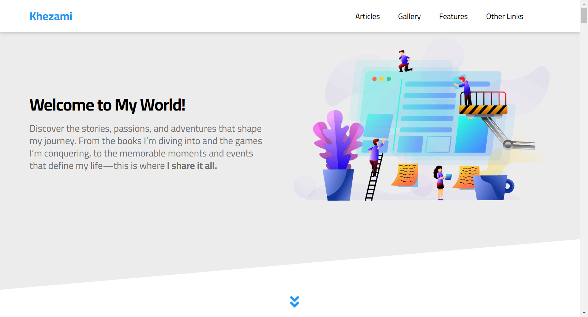
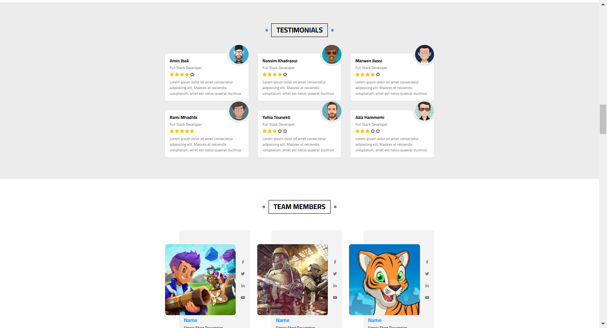
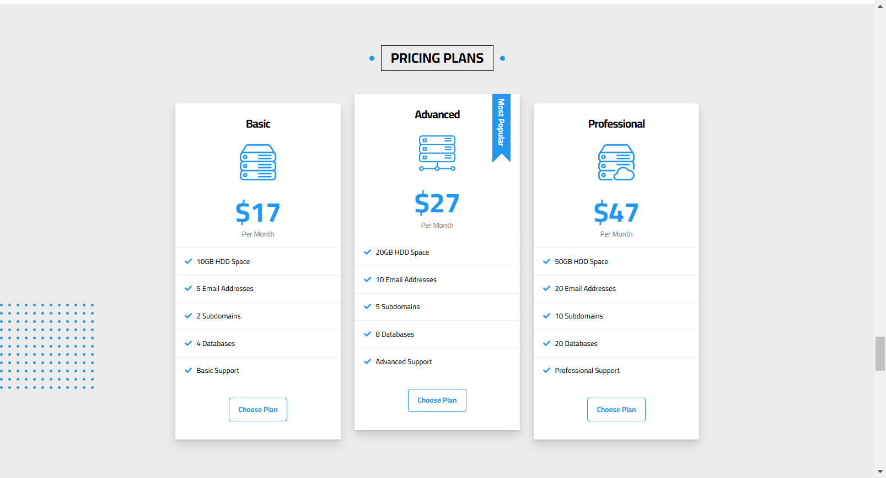

# Animated Portfolio Website

## Overview
This is a modern, animated, and responsive website designed and developed using HTML and CSS. The project showcases my skills in:

- Creating visually appealing and interactive web designs
- Implementing modern animation techniques
- Building fully responsive layouts for various devices and screen sizes
- Demonstrating proficiency in frontend development with clean, maintainable code


## Screenshots

### Homepage

---
###  Team Members and Testimonials

---
###  Pricing Section



## Deployment
Our project can be viewed here:  [ My animated website](https://khezamitaha.github.io/Css_Html_template_3_animation/)
## Features

### 1. **Homepage**
   - A welcoming hero section with smooth animations to grab attention.
   - Clear navigation with a clean layout, allowing seamless user experience.

### 2. **Animations**
   - Carefully crafted CSS animations to make the website dynamic and engaging.
   - Interactive hover effects and transitions to enhance usability.

### 3. **Responsive Design**
   - Mobile-first design ensures excellent performance on smaller screens.
   - Fully optimized for tablets, desktops, and larger devices.

### 4. **Services Section**
   - Outlines available services with visually appealing cards and hover effects.

### 5. **Testimonials**
   - Includes client feedback and testimonials to build trust and credibility.

### 6. **Pricing Section**
   - Showcases flexible pricing plans in a well-structured format.

### 7. **Contact Section**
   - Includes a functional contact form for inquiries.
   - Displays social media links for easy networking.

### 8. **Footer**
   - Contains essential links and copyright information.

## Technologies Used

- **HTML5:** For structuring the content and elements.
- **CSS3:** For styling, animations, and responsive design.


## Highlights

- **Clean and Maintainable Code:** The project emphasizes readability and adherence to modern web development standards.
- **Animation Proficiency:** Leveraged CSS animations for smooth transitions and interactive effects.
- **Responsive Web Design:** Ensures the website adapts to various devices, enhancing usability and accessibility.


## Installation

1. Clone this repository:
   ```bash
   git clone https://github.com/KhezamiTaha/Css_Html_template_3_animation.git
   ```
2. Navigate to the project directory:
   ```bash
   cd Css_Html_template_3_animation
   ```
3. Open the `index.html` file in your browser to view the website.

## Usage

This website is ideal for showcasing:
- Personal or professional projects
- Web animation and responsive design skills

Feel free to use this as a template for your projects.

## License

This project is licensed under the MIT License. You are free to use, modify, and distribute it as needed.


## Contact
For inquiries or collaboration, feel free to reach out:
- **Email:** khezamitaha10@gmail.com
- **LinkedIn:** [Khezami.T](https://www.linkedin.com/in/taha-khezami-2044832b2)
- **GitHub:** [Khezami Taha](https://github.com/KhezamiTaha)
---

Thank you for checking out my animated website!
---
Feel free to explore the code and provide feedback to help me improve further. Your suggestions are always welcome!

